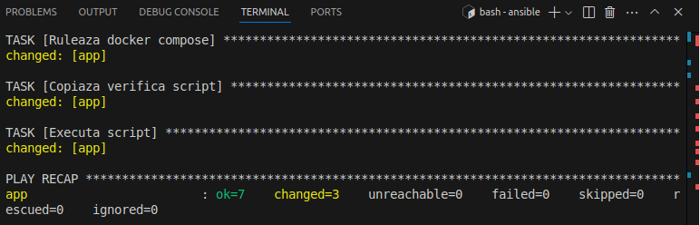
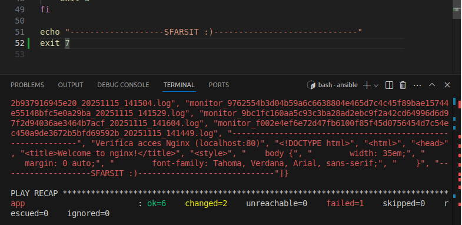

# Platforma de Monitorizare a Starii unui Sistem

## Scopul Proiectului
Monitorizarea informatiilor relevante despre un sistem (masina virtuala, container, etc) si mentinerea unei istorii a starilor pentru eventuale procesari si analize ulterioare.


## Structura Proiectului
- `/scripts`: Contine scripturile principale ale aplicatiei. `monitoring.sh` colecteaza informatii despre sistem si le scrie intr-un fisier log in `sysmonitor/monitor.log`, iar `backup.py` realizeaza backup-ul fisierului de log in `backup/` doar daca acesta s-a modificat.

- `/docker`: Contine doua directoare `monitoring` si `backup`, fiecare cu Dockerfile-ul sau. `monitoring/Dockerfile` creeaza imaginea pentru `monitoring.sh`, iar `backup/Dockerfile` pentru `backup.py`. ` compose.yml` se afla in radacina proiectului si le leaga pe ambele, cu volum comun `sysmonitor`.

- `/k8s`: Contine fisierele pentru Kubernetes: `namespace.yaml`, `deployment.yaml`, `hpa.yaml` si `nginx.yaml`, pentru rularea aplicatiei intr-un namespace dedicat, cu autoscaling si expunerea logurilor prin nginx.

- `/ansible`: Contine playbook-urile `install_docker.yml`, `deploy_platform.yml` si `stop_platform.yml`, precum si `inventory.ini` si scriptul `verifica.sh` pentru verificarea functionarii platformei si a containerelor. Scriptul `verifica.sh` testeaza existenta logurilor, backup-urilor si accesul la nginx.

- `/imagini`: Contine diagrame, capturi

## Setup și Rulare

### Tool-uri necesare
- **Bash** – necesar pentru rularea scriptului `monitoring.sh`
- **Python 3** – necesar pentru rularea scriptului `backup.py`
    Instalare pe Ubuntu/Debian:
    ```bash
    sudo apt update
    sudo apt install -y python3 python3-pip
    ```
- **Docker** – pentru crearea si rularea imaginilor containerizate

    [Instalare Docker](https://docs.docker.com/engine/install/ubuntu/)

- **Docker Compose** – pentru gestionarea celor doua containere ale aplicatiei

    [Instalare Docker Compose ](https://docs.docker.com/compose/install/)

- **Minikube** – pentru rularea aplicatiei in Kubernetes local

    [Instalare Minikube](https://minikube.sigs.k8s.io/docs/start/)

- **kubectl** – pentru aplicarea fisierelor YAML din directorul `k8s/`

    [Instalare kubectl](https://kubernetes.io/docs/tasks/tools/)

- **Ansible** – pentru deployment remote pe o masina virtuala
    ```bash
    sudo apt update
    sudo apt install -y ansible
    ansible --version
    ```
- **Acces SSH configurat** catre masina remote unde va fi rulat playbook-ul Ansible

- **User nou creat pe masina remote** (in implementarea exemplu se foloseste userul `ansible`)
    ```bash
    sudo adduser ansible
    sudo usermod -aG sudo ansible
    sudo usermod -aG docker ansible
    ```
### 1. Rulare locala (fara Docker)
#### 1.1 Rulare script de monitorizare (`monitoring.sh`)
```bash
cd scripts
export INTERVAL_LOG=5 # optional
./monitoring.sh
```
#### 1.2 Rulare script de backup (`backup.py`)
```bash
cd scripts
export INTERVAL_BACKUP=5     # optional
export DIR_BACKUP=./backup   # optional
python3 backup.py
```
### 2. Rulare cu Docker Compose
#### 2.1 Build imagini Docker
```bash
cd platforma-monitorizare
# Build pentru ambele containere
docker compose build
```
#### 2.2 Rulare containere
```bash
# Pornim aplicatia
docker compose up -d
# Verificam containerele active
docker ps
```
#### 2.3 Variabile de mediu in Docker Compose
```bash
In compose.yml, putem seta:
INTERVAL_LOG pentru monitoring (optional, default: 5)
INTERVAL_BACKUP pentru backup (optional, default: 5)
DIR_BACKUP pentru backup (optional, default: ./backup)
```
#### 2.4 Verificare loguri 
```bash  
docker exec -it monitoring_container cat /sysmonitor/monitor.log
docker exec -it backup_container ls -1 /sysmonitor/backup
```

### 3. Setup și Rulare in Kubernetes
#### 3.1 Pornire Minikube
```bash
minikube start
```
####  3.2 Creare namespace
```bash
kubectl apply -f k8s/namespace.yaml
kubectl get namespaces
```

####  3.3 Deploy aplicatie
```bash
kubectl apply -f k8s/deployment.yaml
kubectl apply -f k8s/nginx.yaml
kubectl get pods -n monitoring
kubectl get deployments -n monitoring
kubectl get services -n monitoring
```
####  3.4 Configurare HPA (Autoscaler)
```bash
kubectl apply -f k8s/hpa.yaml
kubectl get hpa -n monitoring
```

### 4. Rulare cu Ansible
#### 4.1 Verificare conectivitate SSH
```bash
ansible all -i ansible/inventory.ini -m ping
```

####  4.2 Instalare Docker pe masina remote
```bash
ansible-playbook -i ansible/inventory.ini ansible/playbooks/install_docker.yml
```

####  4.3 Deploy aplicatie
```bash
ansible-playbook -i ansible/inventory.ini ansible/playbooks/deploy_platform.yml
```
##### !!!   Deploy aplicatie cu succes   !!!




##### !!!   Deploy aplicatie cu eroare   !!!



#### 4.4 Verificare functionare aplicatie pe host
1. **Verificare containere active**
```bash
docker ps
```

2. **Verificare log monitorizare**
```bash
docker exec -it monitoring_container cat /sysmonitor/monitor.log | tail -n 10
```

3. **Verificare backup-uri**
```bash
docker exec -it backup_container ls -1 /sysmonitor/backup
```

####  4.5 Stop aplicatie 
```bash
ansible-playbook -i ansible/inventory.ini ansible/playbooks/stop_platform.yml
```

## Resurse
- [Proiect ](https://github.com/ionsar/platforma-monitorizare)
- [Sintaxa Markdown](https://www.markdownguide.org/cheat-sheet/)

